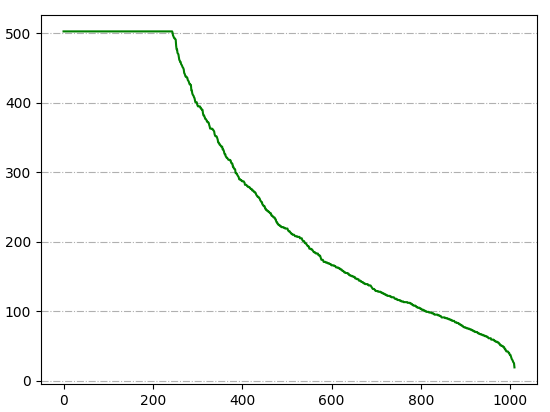
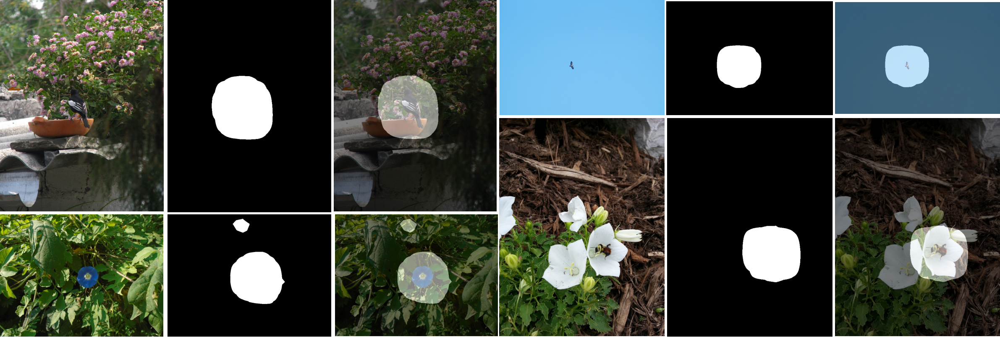

# iNaturalist 2019 in Fine-Grained Visual Categorization 6

## Introduction

iNaturalist Challenge 2019 is a large scale species classification competition, held by CVPR 2019 and Kaggle. This competition provides a large and difficult dataset of fine-grained species, which attracts 214 teams from all over the world. In all these teams, we rank `7/214(3.3%)`, using only single model without ensemble learning.

### Dataset
| Class | Train  | Validate | Test  |
|:-----:|:------:|:--------:|:-----:|
| 1010  | 265213 |   3030   | 35350 |


### Probability Correction


- Problem
    - The training set conforms to the long tail distribution, while validation set conforms to the uniform distribution
- Solution
    - The proportion of images in each class is used as the prior probability. The output probability of trained model will be firstly divided by above prior probability to reduce the impact of class imbalance

### Weakly supervised Localization


- Problem
    - The target usually occupies only a small part of the image
    - The actual resolution of the target is low and details tend to disappear
    - Messy background may bring negative effects
- Solution
    - Firstly, a coarse model is trained to localize the rough area of the target, using GAP (Global Average Pooling).
    - Then, target areas are cropped from the image and used to train a finer model


## Prerequisites
- [Python 3.5](https://www.python.org/)
- [Pytorch 1.0](http://pytorch.org/)
- [OpenCV](https://opencv.org/)
- [Numpy](https://numpy.org/)
- [TensorboardX](https://github.com/lanpa/tensorboardX)
- [Apex](https://github.com/NVIDIA/apex)


## Clone repository

```shell
git clone git@github.com:weijun88/iNaturalist2019.git
cd iNaturalist2019/
```

## Download dataset

Download the following datasets and unzip them into `data` folder

- [iNatualist](https://www.kaggle.com/c/inaturalist-2019-fgvc6)
## Download model

Download [senet154](http://data.lip6.fr/cadene/pretrainedmodels/senet154-c7b49a05.pth) into `res` folder as pretrained model

## Coarse training

```shell
    cd coarse/
    python3 train.py
```
- Train one coarse model of senet154 and use it to extract the localization map of each image

## Fine training

```shell
    cd ../fine/
    python3 train.py
```
- Use localization maps from coarse training to crop the target and use these target images to train one fine model

## Testing

```shell
    python3 test.py
```
